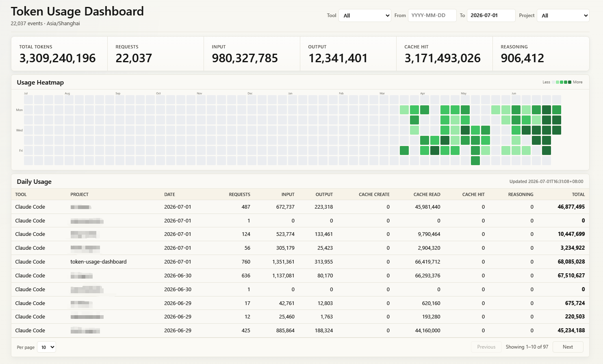

# Token Usage Dashboard

A local web dashboard for tracking Claude Code, Codex, GitHub Copilot, and OpenCode token usage by parsing log files from the local filesystem.



## Quick Start

```powershell
docker compose up -d --build
```

Open [http://localhost:8765](http://localhost:8765)

## Features

- **Multi-source aggregation** — parses Claude Code JSONL logs, Codex session JSONL logs, Codex SQLite database, GitHub Copilot chat logs, and OpenCode SQLite database
- **Project-level breakdown** — automatically groups Claude Code and Copilot usage by project folder name
- **Date range filtering** — filter by start/end date
- **Tool filtering** — view Claude Code, Codex, Copilot, OpenCode, or combined
- **Usage heatmap** — GitHub-style contribution grid for daily total tokens
- **Paginated table** — configurable page size with Previous/Next navigation
- **CSV export** — download filtered data via `/api/export.csv`
- **In-memory caching** — 60-second cache avoids re-parsing log files on repeated requests

## Architecture

```
├── app/
│   ├── server.py          HTTP server, API endpoints
│   └── usage.py           Log parsing, aggregation, caching
├── static/
│   ├── index.html         Single-page application
│   ├── app.js             Frontend logic (ES6+)
│   ├── styles.css         Design system & responsive layout
│   └── favicon.svg        SVG favicon
├── assets/
│   └── screenshot.png     Dashboard screenshot
├── Dockerfile             Python 3.12-slim image
├── docker-compose.yml     Service definition with volume mounts
├── .gitignore
└── README.md
```

### Backend (stdlib only, zero dependencies)

- `ThreadingHTTPServer` serves static files and three API endpoints:
  - `GET /api/usage?tool=&from=&to=&project=&refresh=` — aggregated usage as JSON
  - `GET /api/export.csv` — same data as CSV download
  - `GET /api/projects` — available Claude Code project directories
- Generator functions parse log sources into `UsageEvent` dataclasses:
  - **Claude JSONL** — reads `~/.claude/projects/**/*.jsonl`, deduplicates by message ID, resolves project name from `cwd` field
  - **Codex sessions** — reads `~/.codex/sessions/*.jsonl`, deduplicates by total-token tuple
  - **Codex SQLite** — reads `~/.codex/logs_2.sqlite`, queries `response.completed` events, deduplicates by response ID
  - **GitHub Copilot** — reads `%TEMP%/VSGitHubCopilotLogs/*.chat.log`, extracts `EventType(11)` JSON with input/output/cached/reasoning token counts and model name
  - **OpenCode** — reads `~/.local/share/opencode/opencode.db`, parses `part` table `step-finish` records and `message` table token data with per-step granularity
- `summarize()` aggregates events across 5 period types (daily, weekly, monthly, yearly, total)
- In-process memory cache (60s TTL) avoids re-parsing log files

### Frontend (vanilla, no build step)

- Filter bar with Tool, From/To dates, and Project dropdown (located in page header)
- 6-metric summary bar (Total Tokens, Requests, Input, Output, Cache Hit, Reasoning)
- GitHub-style usage heatmap with quantile-based color levels and tooltip
- Paginated daily usage table sorted by date descending
- Three visual states: loading, data, empty/error
- Responsive layout with breakpoints at 1100px and 720px

## Configuration

### Environment Variables

| Variable | Default | Description |
|---|---|---|
| `TOKEN_USAGE_HOST` | `0.0.0.0` | Server bind address |
| `TOKEN_USAGE_PORT` | `8765` | Server port |
| `TOKEN_USAGE_TZ` | `Asia/Shanghai` | Timezone for log timestamps |
| `TOKEN_USAGE_CLAUDE_PROJECTS` | `~/.claude/projects` | Claude JSONL log directory |
| `TOKEN_USAGE_CODEX_SESSIONS` | `~/.codex/sessions` | Codex session directory |
| `TOKEN_USAGE_CODEX_DB` | `~/.codex/logs_2.sqlite` | Codex SQLite database |
| `TOKEN_USAGE_COPILOT_LOGS` | `%TEMP%\VSGitHubCopilotLogs` | GitHub Copilot chat log directory |
| `TOKEN_USAGE_OPENCODE_DB` | `~/.local/share/opencode/opencode.db` | OpenCode SQLite database |

### Data Sources (read-only Docker mounts)

| Source | Host Path |
|---|---|
| Claude Code logs | `~/.claude/projects/**/*.jsonl` |
| Codex session logs | `~/.codex/sessions/**/*.jsonl` |
| Codex SQLite DB | `~/.codex/logs_2.sqlite` |
| GitHub Copilot (VS) | `%TEMP%\VSGitHubCopilotLogs\*.chat.log` |
| OpenCode DB | `~/.local/share/opencode/opencode.db` |

### Useful Commands

```powershell
# Start
docker compose up -d --build

# View logs
docker compose logs -f

# Stop
docker compose down

# Dev (no Docker)
python -m app.server
```
